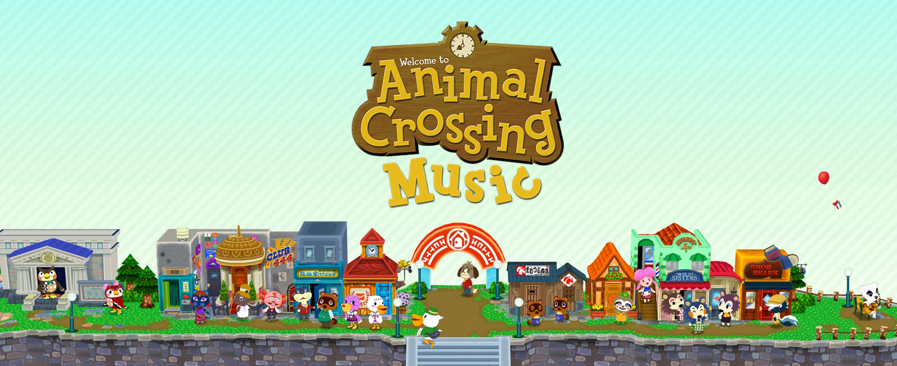

# Animal Crossing Music 🍀 (J variant)

**Animal Crossing Music** is a fun extension for Chrome and Firefox that lets you play Animal Crossing's music in the browser while you browse the web! ✨

The music updates in real-time on the hour, and informs you via an optional desktop notification and customizable town tune! 🌱

***The J variant of Animal Crossing Music is not official.** Please do not go to PikaDude, anyone who works on the main project, or anyone in the Discord server, for any kind of support.*

## Features
### Hourly Music 🕒
Listen to the corresponding hourly music from the main Animal Crossing titles:
  - Animal Crossing
  - Wild World / City Folk
  - New Leaf
  - New Horizons

'Raining' and 'snowing' variants are also included!

### Live Weather 🌧
You can enable the "Live Weather" function so weather variants of the hourly music can be automatically picked according to the weather in your specified location!

### K.K. Slider 🎙
Listen to K.K. Slider's songs! The extension features both 'live' and 'aircheck' version of his tunes.

You can choose whether to keep his appearances to the usual Saturday nights, or to play his songs 24/7.

### Town Tune 🎵
The extension features an awesome Town Tune editor available within the browser.

With it you can compose your custom Town Tune, which will be played every time an hour passes, just like the games!

## Installation
### Stable release
Currently, there is no stable release. Please wait for a future update to this README.

### Other branches (using the source code)
You can download the source code of the project and install the unpacked extension yourself to access the latest, greatest and probably buggy unreleased features and updates. Just click on the `Code` button at the top-right of the page and then on `Download ZIP`.

To install the downloaded project, do the following:
1. Unzip the downloaded file.
2. Go to the [Chrome Extensions Page](chrome://extensions/), which can be found under `Chrome > Settings > Extensions`.
3. Enable the `Developer Mode` switch.
4. Click on `Load Unpacked`.
5. Choose the unzipped project directory.
6. Profit!

If you're having issues making the extension work with Opera GX or another Chromium-based browser, you may need to remove the following lines from `manifest.json`:
```json
   "optional_permissions": [
      "background"
   ],
```

If you're still having trouble, also try:
```json
   "browser_specific_settings": {
      "gecko": {
        "id": "{2fff585f-d956-4ea6-ba18-6fc7177f55a7}"
      }
   },
```

### Branch conventions
- The `stable` branch currently doesn't exist - but when it does, it'll contain the latest stable version of the extension, which you'll be able to find in [GitHub releases](https://github.com/jbmagination/ac-music-extension-j/releases/latest). **Do not merge or make PRs here.**
- The `develop` branch contains the latest fully-integrated features of the extension. **This is where most PRs should be merged into.**
- The `upstream` branch contains the current latest code from `animal-crossing-music-extension/ac-music-extension`. **Do not merge or make PRs here.**
- There may be other branches that are used for feature development that may be too buggy and unstable to have on `develop`, or is simply being tested for another reason. You can find these branches by looking for the `exp/` before their name. **If you do PR to these branches, please note that they may be deleted at any time.**

## Help & Support
*The J variant of Animal Crossing Music is not official.* Please do not go to the Discord server for assistance with the extension! **If you need any help with this extension, make an issue here on GitHub or DM me on Discord!**

Although, feel free to jump into the project's [Discord server](https://discord.gg/4FMrEF8) anyway - it's not a very active server at the moment (today is April 23rd, 2023), but it's a nice little community. (And, of course, you can find me there.)

## Contribute
Contributions to the project are **greatly** appreciated! Here is how you can help to make this project even better:

### Issues
If you want to report a bug, or have a feature request/proposal for improvement, feel free to open a public [issue](https://github.com/jbmagination/ac-music-extension-j/issues) on the project repository.

### PR Submission
[Pull requests](https://github.com/jbmagination/ac-music-extension-j/pulls) are equally welcomed. Just make sure to **not submit them to `stable` or `upstream`** and give some love to the PR description!

## Credit
All of the contributors for versions post-3.0 can be found [here](https://github.com/animal-crossing-music-extension/ac-music-extension/graphs/contributors) and [here](https://github.com/jbmagination/ac-music-extension-j/graphs/contributors).

Credit is due to [Andrex](https://www.neogaf.com/members/andrex.20593/) and [blazescorch2](https://www.neogaf.com/members/blazescorch2.142800/) from NeoGAF for developing the original 1.0 and 2.0 versions of the extension.

Original concept of the extension taken from [Brian Lee](https://b-lee.net/)'s [Animal Crossing music website](https://tane.us/ac/).

## Licensing
Animal Crossing Music is licensed under the zlib license. See [LICENSE.md](./LICENSE.md) for reference.
